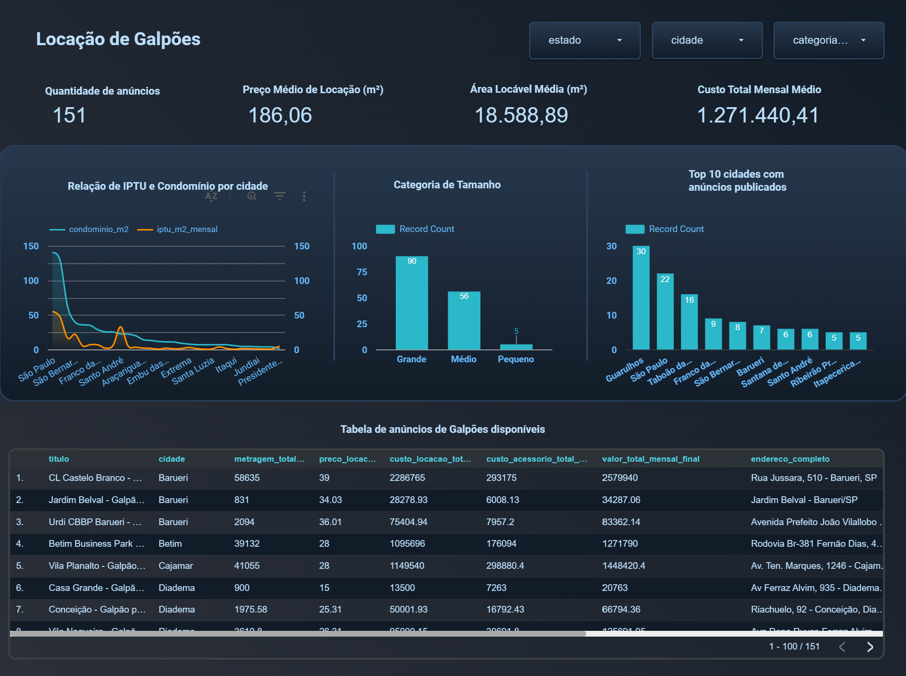

Análise de Anúncios Imobiliários: Galpões e Áreas Industriais
Este projeto de portfólio demonstra um fluxo de trabalho completo de ponta a ponta em ciência de dados e engenharia de dados, cobrindo desde a extração de dados da web até a criação de um painel interativo de Business Intelligence. O objetivo foi coletar, tratar e analisar dados de anúncios de galpões e áreas industriais do site WebIndustrial para fornecer insights valiosos sobre o mercado.

Tecnologias Utilizadas
O projeto foi desenvolvido usando uma combinação de ferramentas de código aberto e serviços em nuvem:

Python: Para a lógica de web scraping e manipulação de dados.

Selenium: Automação de navegação para extrair dados de páginas dinâmicas.

Beautiful Soup: Para a análise e extração de dados HTML.

Ollama & LLM (Modelos de Linguagem): Para o enriquecimento dos dados, especificamente para identificar cidade e estado a partir de endereços brutos.

Google BigQuery: Data warehouse em nuvem para armazenamento, transformação e processamento de grandes volumes de dados.

Google Looker Studio: Ferramenta de Business Intelligence para visualização e criação de um painel interativo.

Fluxo de Trabalho do Projeto
O projeto seguiu uma metodologia estruturada, dividida nas seguintes etapas:

1. Extração de Dados (Web Scraping)

Um script em Python, utilizando Selenium e Beautiful Soup, foi desenvolvido para navegar pelo site WebIndustrial e extrair informações detalhadas de cada anúncio de galpão.

O script lidou com a paginação e garantiu que dados dinâmicos fossem capturados corretamente.

2. Enriquecimento de Dados

Os dados de endereço, muitas vezes incompletos, foram enviados a um Modelo de Linguagem (LLM) executado localmente via Ollama.

O LLM foi capaz de inferir a cidade e o estado com base nos endereços, preenchendo lacunas e enriquecendo a tabela.

3. Armazenamento e Transformação de Dados

A tabela de dados brutos foi carregada manualmente no Google BigQuery.

Utilizando SQL no BigQuery, uma série de transformações foram aplicadas para garantir a qualidade dos dados:

Limpeza de Dados: Remoção de caracteres indesejados (R$, m², ,, .) e espaços em branco.

Conversão de Tipos: Conversão de colunas de texto para numérico (FLOAT64) usando SAFE_CAST para evitar erros.

Criação de Indicadores: Novas métricas (KPIs) foram calculadas, como custo_locacao_total_mensal e valor_total_mensal_final, arredondando os valores para duas casas decimais.

Categorização: Uma nova dimensão (categoria_tamanho) foi criada, classificando os galpões como 'Pequeno', 'Médio' ou 'Grande' com base na área locável.

4. Visualização e Análise

A tabela final, limpa e estruturada, foi conectada ao Google Looker Studio.

Um painel interativo foi desenvolvido com os seguintes componentes:

Filtros: Permitindo a filtragem de dados por Estado, Cidade e Categoria de Tamanho.

KPIs: Cartões de pontuação exibindo métricas-chave do mercado.

Gráficos: Visualizações para identificar tendências, como a distribuição de anúncios por tipo de tamanho e os preços médios por cidade.

Tabela de Detalhes: Uma tabela que exibe os dados completos de cada anúncio, com links para a página original.

Como Executar o Projeto
Para replicar este projeto, siga os passos abaixo:

Instale as dependências do Python:

Bash

pip install -r requirements.txt
Execute o script de extração de dados para gerar a sua tabela de dados brutos.

Carregue os dados brutos no BigQuery.

Execute as consultas SQL de transformação (fornecidas no repositório) no BigQuery para criar sua tabela final.

Crie seu painel no Looker Studio e conecte-o à sua tabela final no BigQuery.

Caso queira testar usando a tabela que eu fiz, criei uma pasata chamada tab_BigQuery com a tabela "tab_webindustrial_final.csv" que foi a mesma que importei no looker

Visualização da Dashboard criada no Looker Studio.
https://lookerstudio.google.com/reporting/9cdbad15-0322-4d57-aa31-39432bf63934

A tabela final, limpa e estruturada, foi conectada ao Google Looker Studio, onde um painel interativo foi desenvolvido para visualizar as métricas e insights do projeto.

